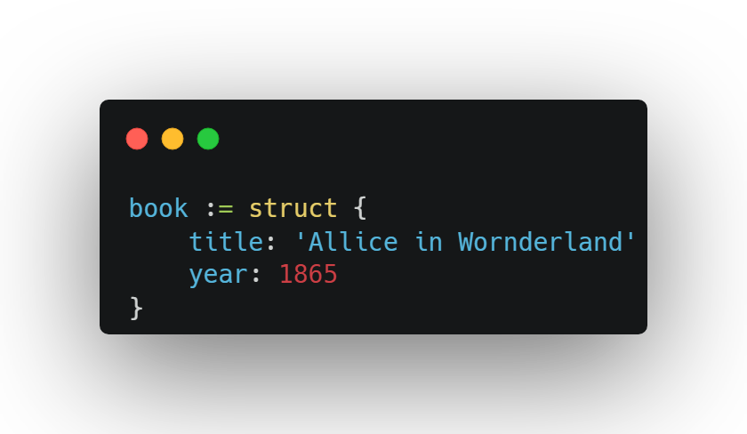
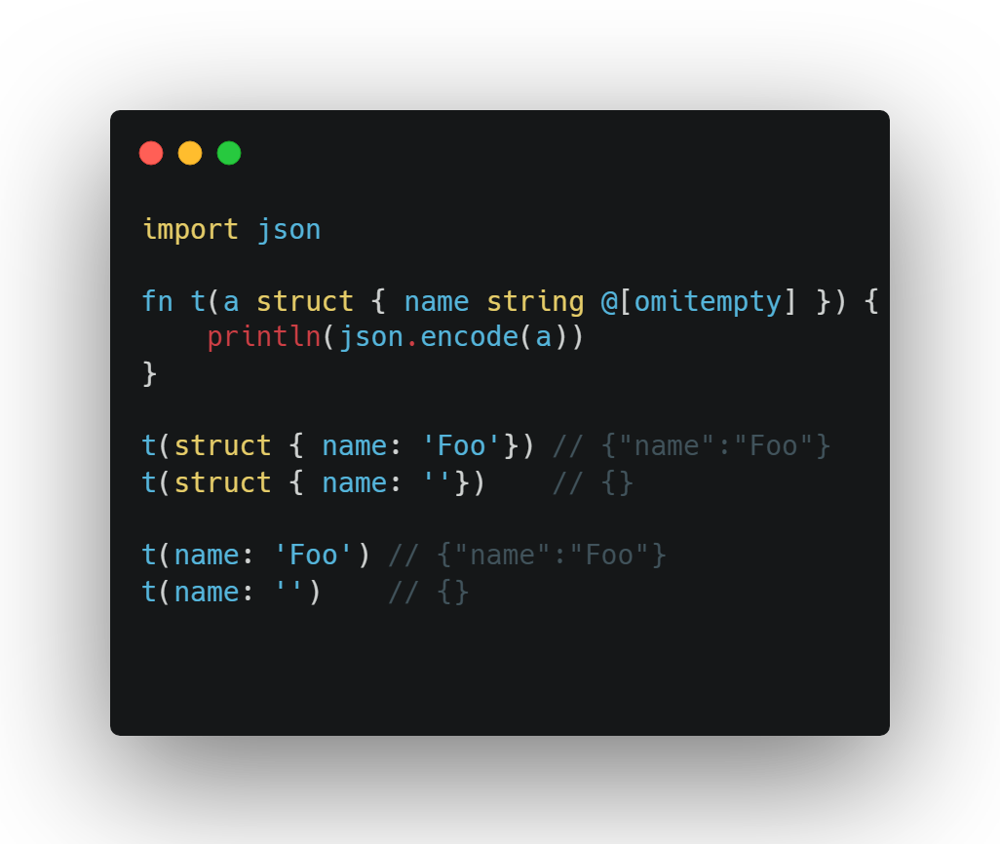

Релиз языка программирования V 0.4.10

Новое в языке:

Добавлены анонимные структуры (https://github.com/vlang/v/issues/23855):

Примеры того как это выглядит:

Удален старый функционал, который был объявлен как deprecated (до этого 6 месяцев было предупреждение о таком коде при компиляции проекта) (https://github.com/vlang/v/pull/23479)

Ломающие изменения:
* Старый синтаксис объявлен [attr] ошибкой в пользу @[attr]
* builtin: string.index_after() теперь возвращает Option (как и string.index()), для старого поведения используйте string.index_after_()
* vweb теперь устарел в пользу более быстрого, стабильного и простого в использовании veb

Множество улучшений парсера и чекера языка, детальный список по ссылке https://github.com/vlang/v/releases/tag/0.4.10

В стандартной библиотеке помимо множества оптимизаций и пополения документации можно выделать такое:
* builtin: add string.split_by_space() https://github.com/vlang/v/pull/23651
* os: добавлены вспомогательные методы File.write_u8/1 и File.read_u8/0
* os: добавлена disk_usage, показывающая доступное место по пути: (https://github.com/vlang/v/pull/23634)
* time: add week_of_year() https://github.com/vlang/v/pull/23838
* x.json2: добавлен Any.as_map_of_strings/0

Среди web изменений можно выделить следующие:
* удален модуль x.vweb (теперь это veb)
* veb.request_id: новая middleware для отслеживания ID запросов (https://github.com/vlang/v/pull/23727)
* Обновлено руководство по veb: https://github.com/vlang/v/tree/master/tutorials/building_a_simple_web_blog_with_veb

Базы данных:
* orm: исправлен кодген для опции fk (https://github.com/vlang/v/issues/23383)
* db.sqlite: добавлена трассировка для большего количества вызовов при использовании -d trace_sqlite, а не только для ORM
* db.pg: добавлена поддержка операторов - db.prepare/3 и db.exec_prepared/2 (https://github.com/vlang/v/pull/23442)
* db.mysql: добавлена поддержка SSL и вынесена во флаг подключения (https://github.com/vlang/v/pull/23975)

Примеры:
* Добавлен пример 1 Billion Row Challenge для демонстрации возможностей производительности языка (https://github.com/vlang/v/pull/23458)
* Добавлен пример игры «Сапер» в examples/gg/minesweeper.v
* Добавлен пример головоломке Sokoban с уровнями (см. https://en.wikipedia.org/wiki/Sokoban )
* Добавлен пример vanilla_http_server- быстрого, многопоточного, неблокируемого, повторно использующего порты и хосты, потокобезопасный, сервер epoll ( https://github.com/vlang/v/pull/23094 )
* Добавлен пример игры про астероиды (сейчас она содержит < 400 строк V, используя gg)
* Добавлен пример небольшой игры, поддерживающую клавиатуру и сенсорное управление (https://github.com/vlang/v/pull/23861)

Появился флаг -show-depgraph, который генерирует изображение с ModGraph: *img*

Vinix, новая ОС/ядро, написанная с нуля на V, теперь может работать с GTK3: *img*

